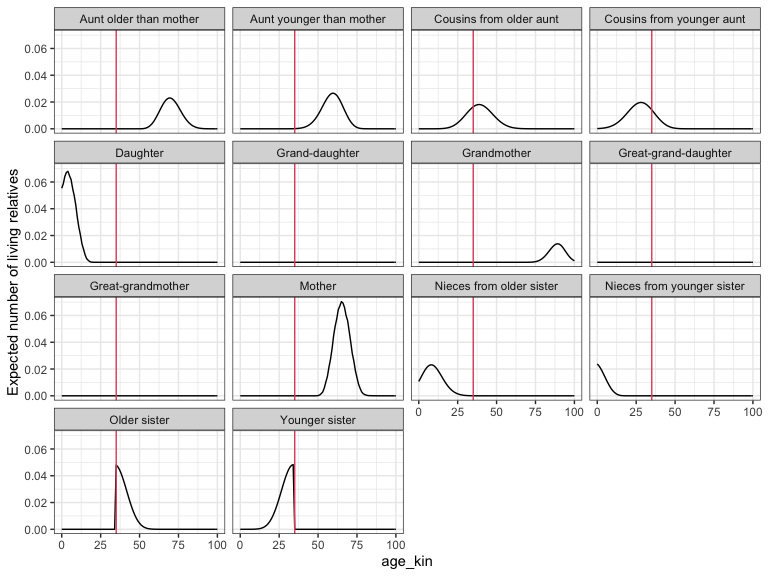

Getting started with matrix kinship models in R using DemoKin
================
Instructor: Diego Alburez-Gutierrez (MPIDR);
The Formal Demography of Kinship: Theory and Application - Dutch
Demography Day; Nov 16 2022

  - [1. Installation](#1-installation)
  - [2. Built-in data](#2-built-in-data)
  - [3. The function `kin()`](#3-the-function-kin)
  - [4. Example: kin counts in time-invariant
    populations](#4-example-kin-counts-in-time-invariant-populations)
  - [5. Vignette and extensions](#5-vignette-and-extensions)
  - [6. Exercises](#6-exercises)
  - [7. Appendix](#7-appendix)
  - [8. Session info](#8-session-info)


# 1\. Installation

Install the [development version from
GitHub](https://github.com/IvanWilli/DemoKin) (could take \~1 minute).
We made changes to the `DemoKin` package ahead of this workshop If you
had already installed the package, please uninstall it and and install
it again.

``` r
# remove.packages("DemoKin")
# install.packages("devtools")
devtools::install_github("IvanWilli/DemoKin", build_vignettes = TRUE)
```

Load packages:

``` r
library(DemoKin)
library(dplyr)
library(tidyr)
library(ggplot2)
library(fields)
```

# 2\. Built-in data

The `DemoKin` package includes data from Sweden as an example. The data
comes from the [Human Mortality Database](https://www.mortality.org/)
and [Human Fertility Database](https://www.humanfertility.org/). These
datasets were loaded using the`DemoKin::get_HMDHFD` function.

### 2.1. `swe_px` matrix; survival probabilities by age (DemoKin’s *U* argument)

This is what the data looks like:

``` r
data("swe_px", package="DemoKin")

swe_px[1:4, 1:4]
```

    ##      1900    1901    1902    1903
    ## 0 0.91060 0.90673 0.92298 0.91890
    ## 1 0.97225 0.97293 0.97528 0.97549
    ## 2 0.98525 0.98579 0.98630 0.98835
    ## 3 0.98998 0.98947 0.99079 0.99125

And plotted over time and age:

``` r
image.plot(
  x = as.numeric(colnames(swe_px))
  , y = 0:nrow(swe_px)
  , z = t(as.matrix(swe_px))
  , xlab = "Year"
  , ylab = "Survival probability"
  )
```

<!-- -->

### 2.2. `swe_asfr` matrix; age specific fertility rate (DemoKin’s *f* argument)

This is what the data looks like:

``` r
data("swe_asfr", package="DemoKin")

swe_asfr[15:20, 1:4]
```

    ##       1900    1901    1902    1903
    ## 14 0.00013 0.00006 0.00008 0.00008
    ## 15 0.00053 0.00054 0.00057 0.00057
    ## 16 0.00275 0.00319 0.00322 0.00259
    ## 17 0.00932 0.00999 0.00965 0.00893
    ## 18 0.02328 0.02337 0.02347 0.02391
    ## 19 0.04409 0.04357 0.04742 0.04380

And plotted over time and age:

``` r
image.plot(
  x = as.numeric(colnames(swe_asfr))
  , y = 0:nrow(swe_asfr)
  , z = t(as.matrix(swe_asfr))
  , xlab = "Year"
  , ylab = "Age-specific fertility (f)"
  )
```

<!-- -->

# 3\. The function `kin()`

`DemoKin` can be used to compute the number and age distribution of
Focal’s relatives under a range of assumptions, including living and
deceased kin. The function `DemoKin::kin()` currently does most of the
heavy lifting in terms of implementing matrix kinship models. This is
what it looks like in action, in this case assuming time-invariant
demographic rates:

``` r
# First, get vectors for a given year
swe_surv_2015 <- DemoKin::swe_px[,"2015"]
swe_asfr_2015 <- DemoKin::swe_asfr[,"2015"]
# Run kinship models
swe_2015 <- kin(U = swe_surv_2015, f = swe_asfr_2015, time_invariant = TRUE)
```

## 3.1. Arguments

  - **U** numeric. A vector (atomic) or matrix of survival probabilities
    with rows as ages (and columns as years in case of matrix).
  - **f** numeric. Same as U but for fertility rates.
  - **time\_invariant** logical. Assume time-invariant rates. Default
    TRUE.
  - **output\_kin** character. kin types to return: “m” for mother, “d”
    for daughter, …

## 3.2. Relative types

Relatives for the `output_kin` argument are identified by a unique code.
Note that the relationship codes used in `DemoKin` differ from those in
Caswell (2019). The equivalence between the two set of codes is given in
the following table:

``` r
demokin_codes()
```

    ##    DemoKin Caswell                      Label
    ## 1      coa       t    Cousins from older aunt
    ## 2      cya       v  Cousins from younger aunt
    ## 3        d       a                   Daughter
    ## 4       gd       b             Grand-daughter
    ## 5      ggd       c       Great-grand-daughter
    ## 6      ggm       h          Great-grandmother
    ## 7       gm       g                Grandmother
    ## 8        m       d                     Mother
    ## 9      nos       p   Nieces from older sister
    ## 10     nys       q Nieces from younger sister
    ## 11      oa       r     Aunt older than mother
    ## 12      ya       s   Aunt younger than mother
    ## 13      os       m               Older sister
    ## 14      ys       n             Younger sister

## 3.4. Value

`DemoKin::kin()` returns a list containing two data frames: `kin_full`
and `kin_summary`.

``` r
str(swe_2015)
```

    ## List of 2
    ##  $ kin_full   : tibble[,7] [142,814 x 7] (S3: tbl_df/tbl/data.frame)
    ##   ..$ year     : logi [1:142814] NA NA NA NA NA NA ...
    ##   ..$ cohort   : logi [1:142814] NA NA NA NA NA NA ...
    ##   ..$ age_focal: int [1:142814] 0 1 2 3 4 5 6 7 8 9 ...
    ##   ..$ kin      : chr [1:142814] "d" "d" "d" "d" ...
    ##   ..$ age_kin  : int [1:142814] 0 0 0 0 0 0 0 0 0 0 ...
    ##   ..$ living   : num [1:142814] 0 0 0 0 0 0 0 0 0 0 ...
    ##   ..$ dead     : num [1:142814] 0 0 0 0 0 0 0 0 0 0 ...
    ##  $ kin_summary: tibble[,10] [1,414 x 10] (S3: tbl_df/tbl/data.frame)
    ##   ..$ age_focal     : int [1:1414] 0 0 0 0 0 0 0 0 0 0 ...
    ##   ..$ kin           : chr [1:1414] "coa" "cya" "d" "gd" ...
    ##   ..$ year          : logi [1:1414] NA NA NA NA NA NA ...
    ##   ..$ cohort        : logi [1:1414] NA NA NA NA NA NA ...
    ##   ..$ count_living  : num [1:1414] 0.2752 0.0898 0 0 0 ...
    ##   ..$ mean_age      : num [1:1414] 8.32 4.05 NaN NaN NaN ...
    ##   ..$ sd_age        : num [1:1414] 6.14 3.68 NaN NaN NaN ...
    ##   ..$ count_dead    : num [1:1414] 0 0 0 0 0 0 0 0 0 0 ...
    ##   ..$ count_cum_dead: num [1:1414] 0 0 0 0 0 0 0 0 0 0 ...
    ##   ..$ mean_age_lost : num [1:1414] NaN NaN NaN NaN NaN NaN NaN NaN NaN NaN ...

### `kin_full`

This data frame contains expected kin counts by year (or cohort), age of
Focal, and age of kin.

``` r
head(swe_2015$kin_full)
```

    ## # A tibble: 6 x 7
    ##   year  cohort age_focal kin   age_kin living  dead
    ##   <lgl> <lgl>      <int> <chr>   <int>  <dbl> <dbl>
    ## 1 NA    NA             0 d           0      0     0
    ## 2 NA    NA             1 d           0      0     0
    ## 3 NA    NA             2 d           0      0     0
    ## 4 NA    NA             3 d           0      0     0
    ## 5 NA    NA             4 d           0      0     0
    ## 6 NA    NA             5 d           0      0     0

### `kin_summary`

This is a ‘summary’ data frame derived from `kin_full`. To produce it,
we sum over all ages of kin to produce a data frame of expected kin
counts by year or cohort and age of Focal (but *not* by age of kin).
This is how the `kin_summary` object is derived:

``` r
kin_by_age_focal <- 
  swe_2015$kin_full %>% 
  group_by(cohort, kin, age_focal) %>% 
  summarise(count = sum(living)) %>% 
  ungroup()

# Check that they are identical (for living kin only here)

kin_by_age_focal %>% 
  select(cohort, kin, age_focal, count) %>% 
  identical(
    swe_2015$kin_summary %>% 
      select(cohort, kin, age_focal, count = count_living) %>% 
      arrange(cohort, kin, age_focal)
  )
```

    ## [1] TRUE

# 4\. Example: kin counts in time-invariant populations

Following Caswell (2019), we assume a female closed population in which
everyone experiences the Swedish 1950 mortality and fertility rates at
each age throughout their life. We then ask:

> How can we characterize the kinship network of an average member of
> the population (call her ‘Focal’)?

For this exercise, we’ll use the pre-loaded Swedish data.

``` r
# First, get vectors for a given year
swe_surv_2015 <- DemoKin::swe_px[,"2015"]
swe_asfr_2015 <- DemoKin::swe_asfr[,"2015"]
# Run kinship models
swe_2015 <- kin(U = swe_surv_2015, f = swe_asfr_2015, time_invariant = TRUE)
```

## 4.1. ‘Keyfitz’ kinship diagram

We can visualize the implied kin counts for a Focal woman aged 35 yo in
a time-invariant population using a network or ‘Keyfitz’ kinship diagram
(Keyfitz and Caswell 2005) with the `plot_diagram` function:

``` r
swe_2015$kin_summary %>% 
  filter(age_focal == 35) %>% 
  select(kin, count = count_living) %>% 
  plot_diagram(rounding = 2)
```

<!-- -->

## 4.2. Living kin

Now, let’s visualize how the expected number of daughters, siblings,
cousins, etc., changes over the lifecourse of Focal (now, with full
names to identify each relative type using the function
`DemoKin::rename_kin()`).

``` r
swe_2015$kin_summary %>%
  rename_kin() %>% 
  ggplot() +
  geom_line(aes(age_focal, count_living))  +
  geom_vline(xintercept = 35, color=2)+
  theme_bw() +
  labs(x = "Focal's age") +
  facet_wrap(~kin)
```

<!-- -->

> Note that we are working in a time invariant framework. You can think
> of the results as analogous to life expectancy (i.e., expected years
> of life for a synthetic cohort experiencing a given set of period
> mortality rates).

How does overall family size (and family composition) vary over life for
an average woman who survives to each age?

``` r
counts <- 
  swe_2015$kin_summary %>%
  group_by(age_focal) %>% 
  summarise(count = sum(count_living)) %>% 
  ungroup()

swe_2015$kin_summary %>%
  select(age_focal, kin, count_living) %>% 
  rename_kin(., consolidate_column = "count_living") %>%
  ggplot(aes(x = age_focal, y = count)) +
  geom_area(aes(fill = kin), colour = "black") +
  geom_line(data = counts, size = 2) +
  labs(x = "Focal's age", y = "Number of living female relatives") +
  coord_cartesian(ylim = c(0, 6)) +
  theme_bw() +
  theme(legend.position = "bottom")
```

<!-- -->

## 4.3. Age distribution of living kin

How old are Focal’s relatives? Using the `kin_full` data frame, we can
visualize the age distribution of Focal’s relatives throughout Focal’s
life. For example when Focal is 35, what are the ages of her relatives:

``` r
swe_2015$kin_full %>%
DemoKin::rename_kin() %>%
filter(age_focal == 35) %>%
ggplot() +
geom_line(aes(age_kin, living)) +
geom_vline(xintercept = 35, color=2) +
labs(y = "Expected number of living relatives") +
theme_bw() +
facet_wrap(~kin)
```

<!-- -->

## 4.4. Deceased kin

We have focused on living kin, but what about relatives who have died
during her life? The output of `kin` also includes information of kin
deaths experienced by Focal.

We start by considering the number of kin deaths that can expect to
experience at each age. In other words, the non-cumulative number of
deaths in the family that Focal experiences at a given age.

``` r
loss1 <- 
  swe_2015$kin_summary %>%
  filter(age_focal>0) %>%
  group_by(age_focal) %>% 
  summarise(count = sum(count_dead)) %>% 
  ungroup()

swe_2015$kin_summary %>%
  filter(age_focal>0) %>%
  group_by(age_focal, kin) %>% 
  summarise(count = sum(count_dead)) %>% 
  ungroup() %>% 
  rename_kin(., consolidate_column = "count") %>% 
  ggplot(aes(x = age_focal, y = count)) +
  geom_area(aes(fill = kin), colour = "black") +
  geom_line(data = loss1, size = 2) +
  labs(x = "Focal's age", y = "Number of kin deaths experienced at each age") +
  coord_cartesian(ylim = c(0, 0.086)) +
  theme_bw() +
  theme(legend.position = "bottom")
```

    ## `summarise()` has grouped output by 'age_focal'. You can override using the
    ## `.groups` argument.

<!-- -->

Now, we combine all kin types to show the cumulative burden of kin death
for an average member of the population surviving to each age:

``` r
loss2 <- 
  swe_2015$kin_summary %>%
  group_by(age_focal) %>% 
  summarise(count = sum(count_cum_dead)) %>% 
  ungroup()


swe_2015$kin_summary %>%
  group_by(age_focal, kin) %>% 
  summarise(count = sum(count_cum_dead)) %>% 
  ungroup() %>% 
  rename_kin(., consolidate = "count") %>% 
  ggplot(aes(x = age_focal, y = count)) +
  geom_area(aes(fill = kin), colour = "black") +
  geom_line(data = loss2, size = 2) +
  labs(x = "Focal's age", y = "Number of kin deaths experienced (cumulative)") +
  theme_bw() +
  theme(legend.position = "bottom")
```

    ## `summarise()` has grouped output by 'age_focal'. You can override using the
    ## `.groups` argument.

<!-- -->

A member of the population aged 15, 50, and 65yo will have experienced,
on average, the death of 0.5, 1.9, 2.9 relatives, respectively. We can
decompose this by relative type:

# 5\. Vignette and extensions

For more details on `DemoKin`, including an extension to time
varying-populations rates, deceased kin, and multi-state models, see
`vignette("Reference", package = "DemoKin")`. If the vignette does not
load, you may need to install the package as
`devtools::install_github("IvanWilli/DemoKin", build_vignettes = TRUE)`.

For a detailed description of extensions of the matrix kinship model,
see:

  - time-invariant rates (Caswell 2019),
  - multistate models (Caswell 2020),
  - time-varying rates (Caswell and Song 2021), and
  - two-sex models (Caswell 2022).

# 6\. Exercises

**For all exercises, assume time-invariant rates at the 2010 levels in
Sweden and a female-only population. All exercises can be completed
using datasets included in DemoKin.**

## Exercise 1. Offspring availability and loss

Use `DemoKin` (assuming time-invariant rates at the 2010 levels in
Sweden and a female-only population) to explore offspring survival and
loss for mothers.

**Answer**: What is the expected number of surviving offspring for an
average woman aged 65?

``` r
# First, get vectors for a given year
swe_surv_x <- DemoKin::swe_px[,"2010"]
swe_asfr_x <- DemoKin::swe_asfr[,"2010"]
# Run kinship models
swe_x <- kin(U = swe_surv_x, f = swe_asfr_x, time_invariant = TRUE, output_kin = c("d"))

swe_x$kin_summary %>%
  group_by(age_focal) %>% 
  summarise(count = sum(count_living)) %>% 
  ungroup() %>% 
  filter(age_focal == 65)
```

    ## # A tibble: 1 x 2
    ##   age_focal count
    ##       <int> <dbl>
    ## 1        65 0.965

**Answer**: What is the cumulative number of offspring deaths
experienced by an average woman who survives to age 65?

``` r
swe_x$kin_summary %>%
  group_by(age_focal) %>% 
  summarise(count = sum(count_cum_dead)) %>% 
  ungroup() %>% 
  filter(age_focal == 65)
```

    ## # A tibble: 1 x 2
    ##   age_focal   count
    ##       <int>   <dbl>
    ## 1        65 0.00842

## Exercise 2. Mean age of kin

The output of `DemoKin::kin` includes information on the average age of
Focal’s relatives (in the columns `kin_summary$mean_age` and
`kin_summary$$sd_age`). For example, this allows us to determine the
mean age of Focal’s sisters over the lifecourse of Focal:

``` r
swe_2015$kin_summary %>%  
  filter(kin %in% c("os", "ys")) %>% 
  rename_kin() %>% 
  select(kin, age_focal, mean_age, sd_age) %>% 
  pivot_longer(mean_age:sd_age) %>% 
  ggplot(aes(x = age_focal, y = value, colour = kin)) +
  geom_line() +
  facet_wrap(~name, scales = "free") +
  labs(y = "Mean age of sister(s)") +
  theme_bw()
```

    ## Warning: Removed 1 row(s) containing missing values (geom_path).

<!-- -->

**Instructions**

Compute the the mean and SD of the age of Focal’s sisters over the ages
of Focal **by hand** (i.e., using the raw output in `kin_full`). Plot
separately (1) for younger and older sisters, (2) and for all sisters.

First, get mean and SD of ages of sisters distinguishing between younger
and older sisters:

``` r
# First, get vectors for a given year
swe_surv_x <- DemoKin::swe_px[,"2010"]
swe_asfr_x <- DemoKin::swe_asfr[,"2010"]
# Run kinship models
swe_x <- kin(U = swe_surv_x, f = swe_asfr_x, time_invariant = TRUE, output_kin = c("os", "ys"))

# For plotting
dummy <- data.frame(
      age_focal = 0:100
      , name = "mean"
      , value = 0:100
      , kin = "os"
      )

# Younger and older sister separately
swe_x$kin_full %>% 
  rename_kin() %>% 
  group_by(age_focal, kin) %>% 
  summarise(
    mean = sum(0:100*living)/sum(living)
    , sd = sqrt(sum(living * (0:100 - mean)^2) / sum(living))
  ) %>% 
  ungroup() %>% 
  pivot_longer(cols = mean:sd) %>% 
  ggplot(aes(x = age_focal, y = value, colour = kin)) +
  geom_line() +
  geom_line(data = dummy, colour = "black", linetype = "dashed") +
  # geom_abline(slope = 1, linetype = "dashed") +
  facet_wrap(~name, scales = "free") +
  labs(y = "Age of sister") +
  theme_bw()
```

    ## `summarise()` has grouped output by 'age_focal'. You can override using the
    ## `.groups` argument.

    ## Warning: Removed 1 row(s) containing missing values (geom_path).

<!-- -->

Second, get ages of all sisters, irrespective of whether they are older
or younger:

``` r
# All sister together
swe_x$kin_full %>% 
  group_by(age_focal) %>% 
  summarise(
    mean = sum(0:100*living)/sum(living)
    , sd = sqrt(sum(living * (0:100 - mean)^2) / sum(living))
  ) %>% 
  ungroup() %>% 
  pivot_longer(cols = mean:sd) %>% 
  ggplot(aes(x = age_focal, y = value)) +
  geom_line() +
    geom_line(data = dummy, colour = "red", linetype = "dashed") +
  facet_wrap(~name, scales = "free") +
  labs(y = "Age of sister") +
  theme_bw()
```

<!-- -->

## Exercise 3. Living mother

What is the probability that Focal (an average Swedish woman) has a
living mother over Focal’s live?

**Instructions**

Use DemoKin to obtain
"),
the probability of having a living mother at age
 in a stable population.
Conditional on ego’s survival,
}") can be thought of as a survival probability in a life table:
it has to be equal to one when
 is equal to zero (the
mother is alive when she gives birth), and goes monotonically to zero.

**Answer:** What is the probability that Focal has a living mother when
Focal turns 70 years old?

``` r
# First, get vectors for a given year
swe_surv_x <- DemoKin::swe_px[,"2010"]
swe_asfr_x <- DemoKin::swe_asfr[,"2010"]
# Run kinship models
swe_x <- kin(U = swe_surv_x, f = swe_asfr_x, time_invariant = TRUE, output_kin = "m")

swe_x$kin_summary %>% 
  ggplot(aes(x = age_focal, y = count_living)) +
  geom_line() +
  labs(x = "Focal's age", y = "M1(a)") +
  theme_bw()
```

<!-- -->

``` r
swe_x$kin_summary$count_living[71]
```

    ## [1] 0.0538275

## Exercise 4. Sandwich Generation

The ‘Sandwich Generation’ refers to persons who are squeezed between
frail older parents and young dependent children and are assumed to have
simultaneous care responsibilities for multiple generations, potentially
limiting their ability to provide care. In demography, ‘sandwichness’ is
a generational process that depends on the genealogical position of an
individual vis-a-vis their ascendants and descendants. For this
exercise, we consider an individual to be ‘sandwiched’ if they have at
least one child aged 
or younger and a parent or parent within
 years of death.
Alburez‐Gutierrez, Mason, and Zagheni (2021) defined the probability
that an average woman aged  is ‘sandwiched’ in a stable female population as:

  
![&#10;S(a) = \\underbrace{\\left(1 - \\prod\_{x=1}^{15} \[1 -
m\_{a-x})\] \\right)}\_{\\substack{\\text{fertility risk in the}\\\\
\\text{$15$ years preceding age 'a'}}} \\times
\\underbrace{M\_1(a)}\_{\\substack{\\text{Prob. that mother of ego}\\\\
\\text{is alive when ego is 'a' years old}}} \\times
\\underbrace{\\left(1-
\\frac{M\_1(a+5)}{M\_1(a)}\\right)}\_{\\substack{\\text{Prob. that
mother of ego}\\\\ \\text{would die within $5$ years}}}
&#10;](https://latex.codecogs.com/png.latex?%0AS%28a%29%20%3D%20%5Cunderbrace%7B%5Cleft%281%20-%20%5Cprod_%7Bx%3D1%7D%5E%7B15%7D%20%5B1%20-%20m_%7Ba-x%7D%29%5D%20%5Cright%29%7D_%7B%5Csubstack%7B%5Ctext%7Bfertility%20risk%20in%20the%7D%5C%5C%20%5Ctext%7B%2415%24%20years%20preceding%20age%20%27a%27%7D%7D%7D%20%5Ctimes%20%5Cunderbrace%7BM_1%28a%29%7D_%7B%5Csubstack%7B%5Ctext%7BProb.%20that%20mother%20of%20ego%7D%5C%5C%20%5Ctext%7Bis%20alive%20when%20ego%20is%20%27a%27%20years%20old%7D%7D%7D%20%5Ctimes%20%20%5Cunderbrace%7B%5Cleft%281-%20%20%5Cfrac%7BM_1%28a%2B5%29%7D%7BM_1%28a%29%7D%5Cright%29%7D_%7B%5Csubstack%7B%5Ctext%7BProb.%20that%20mother%20of%20ego%7D%5C%5C%20%5Ctext%7Bwould%20die%20within%20%245%24%20years%7D%7D%7D%20%20%20%20%0A
"
S(a) = \\underbrace{\\left(1 - \\prod_{x=1}^{15} [1 - m_{a-x})] \\right)}_{\\substack{\\text{fertility risk in the}\\\\ \\text{$15$ years preceding age 'a'}}} \\times \\underbrace{M_1(a)}_{\\substack{\\text{Prob. that mother of ego}\\\\ \\text{is alive when ego is 'a' years old}}} \\times  \\underbrace{\\left(1-  \\frac{M_1(a+5)}{M_1(a)}\\right)}_{\\substack{\\text{Prob. that mother of ego}\\\\ \\text{would die within $5$ years}}}    
")  

where

  -  is the fertility of women at age
    , and
  - ")
    is the probability of having a living mother at age
     in a stable
    population.

These estimates refer to an average woman in a female population,
ignoring the role of offspring mortality.

**Instructions**

Use DemoKin to compute the probability that Focal is sandwiched,
"), between
ages 15 and 75. Assume time-invariant rates at the 2010 levels and a
female-only population.

**Answer:** At which age is Focal at a highest risk of finding herself
sandwiched between young dependent children and fragile older parents?

``` r
# First, get vectors for a given year
swe_surv_x <- DemoKin::swe_px[,"2010"]
swe_asfr_x <- DemoKin::swe_asfr[,"2010"]
# Run kinship models
swe_x <- kin(U = swe_surv_x, f = swe_asfr_x, time_invariant = TRUE, output_kin = "m")

M1 <- swe_x$kin_summary$count_living

# Implement equation: 

ages <- 15:75
  
S <- numeric(0)

for (a in ages){
  a_minus_x <- a - 1:15
  a_minus_x <- a_minus_x[a_minus_x > 0]

  fert_risk <- 1 - prod(1 - swe_asfr_x[a_minus_x])

  M1a <- M1[a]

  mom_dies <- 1 - M1[a + 5]/M1[a]

  Sa <- fert_risk * M1a * mom_dies
  S <- c(S, Sa)
}

max_S <- ages[max(S) == S]

data.frame(age_focal = ages, y = S) %>% 
  ggplot(aes(x = age_focal, y = S)) +
  geom_line() +
  geom_vline(xintercept = max_S, colour = "red") +
  labs(x = "Focal's age", y = "Probability of Sandwich S(a)") +
  theme_bw()
```

<!-- -->

# 7\. Appendix

## 7.1. Mean age of living kin

The output of the `DemoKin::kin()` function can also be used to easily
determine the mean age Focal’s relatives by kin type. For simplicity,
let’s focus on a Focal aged 35 yo and get the mean age (and standard
deviation) of her relatives in our time-invariant population.

``` r
ages_df <- 
  swe_2015$kin_summary %>% 
  filter(age_focal == 35) %>% 
  select(kin, mean_age, sd_age)

ma <- 
  ages_df %>% 
  filter(kin=="m") %>% 
  pull(mean_age) %>% 
  round(1)

sda <- 
  ages_df %>% 
  filter(kin=="m") %>% 
  pull(sd_age) %>% 
  round(1)

print(paste0("The mother of a 35-yo Focal woman in our time-invariant population is, on average, ", ma," years old, with a standard deviation of ", sda," years."))
```

    ## [1] "The mother of a 35-yo Focal woman in our time-invariant population is, on average, 65.4 years old, with a standard deviation of 5.1 years."

## 7.2. Visualizing living kin

Finally, let´s visualize the living kin by type and mean age during
Ego’s life course:

``` r
swe_2015$kin_full %>%
  filter(kin %in% c("m", "gm", "d", "gd")) %>%
  rename_kin() %>% 
  group_by(age_focal, kin) %>% 
  summarise(
    count = sum(living)
    , mean_age = sum(living * age_kin, na.rm=T)/sum(living)
    ) %>% 
  ggplot(aes(age_focal,mean_age)) + 
  geom_point(aes(size=count,color=kin)) +
  geom_line(aes(color=kin)) +
  scale_x_continuous(name = "Age Focal", breaks = seq(0,100,10), labels = seq(0,100,10))+
  scale_y_continuous(name = "Age kin", breaks = seq(0,100,10), labels = seq(0,100,10))+
  geom_segment(x = 0, y = 0, xend = 100, yend = 100, color = 1, linetype=2)+
  labs(color="Relative",size="Living")+
  coord_fixed() +
  theme_bw()
```

    ## `summarise()` has grouped output by 'age_focal'. You can override using the
    ## `.groups` argument.

    ## Warning: Removed 87 rows containing missing values (geom_point).

    ## Warning: Removed 87 row(s) containing missing values (geom_path).

<!-- -->

# 8\. Session info

``` r
sessionInfo()
```

    ## R version 4.0.2 (2020-06-22)
    ## Platform: x86_64-w64-mingw32/x64 (64-bit)
    ## Running under: Windows 10 x64 (build 19044)
    ## 
    ## Matrix products: default
    ## 
    ## locale:
    ## [1] LC_COLLATE=English_United Kingdom.1252 
    ## [2] LC_CTYPE=English_United Kingdom.1252   
    ## [3] LC_MONETARY=English_United Kingdom.1252
    ## [4] LC_NUMERIC=C                           
    ## [5] LC_TIME=English_United Kingdom.1252    
    ## 
    ## attached base packages:
    ## [1] grid      stats     graphics  grDevices utils     datasets  methods  
    ## [8] base     
    ## 
    ## other attached packages:
    ## [1] fields_11.6     spam_2.6-0      dotCall64_1.0-1 ggplot2_3.3.3  
    ## [5] tidyr_1.1.3     dplyr_1.0.5     DemoKin_1.0.0  
    ## 
    ## loaded via a namespace (and not attached):
    ##  [1] highr_0.8        pillar_1.5.1     compiler_4.0.2   tools_4.0.2     
    ##  [5] digest_0.6.28    evaluate_0.17    lifecycle_1.0.0  tibble_3.1.0    
    ##  [9] gtable_0.3.0     pkgconfig_2.0.3  rlang_1.0.2      igraph_1.2.6    
    ## [13] cli_3.2.0        DBI_1.1.1        rstudioapi_0.13  yaml_2.2.1      
    ## [17] xfun_0.21        fastmap_1.1.0    withr_2.5.0      stringr_1.4.0   
    ## [21] knitr_1.31       maps_3.3.0       generics_0.1.0   vctrs_0.4.1     
    ## [25] tidyselect_1.1.0 glue_1.6.2       R6_2.5.0         fansi_0.4.2     
    ## [29] rmarkdown_2.7    farver_2.1.0     purrr_0.3.4      magrittr_2.0.1  
    ## [33] scales_1.1.1     ellipsis_0.3.2   htmltools_0.5.2  assertthat_0.2.1
    ## [37] colorspace_2.0-0 labeling_0.4.2   utf8_1.2.1       stringi_1.5.3   
    ## [41] munsell_0.5.0    crayon_1.4.1

## References

<div id="refs" class="references">

<div id="ref-alburezgutierrez_sandwich_2021">

Alburez‐Gutierrez, Diego, Carl Mason, and Emilio Zagheni. 2021. “The
‘Sandwich Generation’ Revisited: Global Demographic Drivers of Care
Time Demands.” *Population and Development Review* 47 (4): 997–1023.
<https://doi.org/10.1111/padr.12436>.

</div>

<div id="ref-caswell_formal_2019">

Caswell, Hal. 2019. “The Formal Demography of Kinship: A Matrix
Formulation.” *Demographic Research* 41 (September): 679–712.
<https://doi.org/10.4054/DemRes.2019.41.24>.

</div>

<div id="ref-caswell_formal_2020">

———. 2020. “The Formal Demography of Kinship II: Multistate Models,
Parity, and Sibship.” *Demographic Research* 42 (June): 1097–1146.
<https://doi.org/10.4054/DemRes.2020.42.38>.

</div>

<div id="ref-caswell_formal_2022">

———. 2022. “The Formal Demography of Kinship IV: Two-Sex Models and
Their Approximations.” *Demographic Research* 47 (September): 359–96.
<https://doi.org/10.4054/DemRes.2022.47.13>.

</div>

<div id="ref-caswell_formal_2021">

Caswell, Hal, and Xi Song. 2021. “The Formal Demography of Kinship. III.
Kinship Dynamics with Time-Varying Demographic Rates.” *Demographic
Research* 45: 517–46.

</div>

<div id="ref-Keyfitz2005">

Keyfitz, Nathan, and Hal Caswell. 2005. *Applied Mathematical
Demography*. New York: Springer.

</div>

</div>
