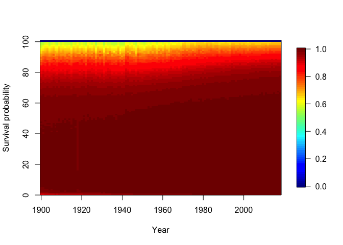

Getting started with matrix kinship models in R using DemoKin
================
Instructor: Sha Jiang (Stanford University); Diego Alburez-Gutierrez
(Max Planck Institute for Demographic Research)

For Workshop ‘Kinship networks, genealogies and relatedness in
structured populations’ at the 8th Meeting of the Evolutionary
Demography Society, March 31 2023.  
This handout is adpated from the previous version by Diego
Alburez-Gutierrez (Max Planck Institute for Demographic Research) and
Ivan Williams (University of Buenos Aires).

-   [1. Installation](#1-installation)
-   [2. Built-in data](#2-built-in-data)
-   [3. The function `kin()`](#3-the-function-kin)
-   [4. Example: kin counts in time-invariant
    populations](#4-example-kin-counts-in-time-invariant-populations)
-   [5. Example: kin counts in time-varying
    populations](#5-example-kin-counts-in-time-varying-populations)
-   [6. Exercises](#6-exercises)
-   [7. Vignette and extensions](#7-vignette-and-extensions)
-   [8. Appendix](#8-appendix)
-   [9. Session info](#9-session-info)


# 1. Installation

Install the [development version from
GitHub](https://github.com/IvanWilli/DemoKin) (could take \~1 minute).
We made changes to the `DemoKin` package ahead of this workshop If you
had already installed the package, please uninstall it and and install
it again.

``` r
# remove.packages("DemoKin")
# install.packages("devtools")
devtools::install_github("IvanWilli/DemoKin", build_vignettes = TRUE)
```

Load packages:

``` r
library(DemoKin)
library(dplyr)
library(tidyr)
library(ggplot2)
library(fields)
library(knitr)
```

# 2. Built-in data

The `DemoKin` package includes data from Sweden as an example. The data
comes from the [Human Mortality Database](https://www.mortality.org/)
and [Human Fertility Database](https://www.humanfertility.org/). These
datasets were loaded using the`DemoKin::get_HMDHFD` function.

### 2.1. `swe_px` matrix; survival probabilities by age (DemoKin’s *U* argument)

This is what the data looks like:

``` r
data("swe_px", package="DemoKin")

swe_px[1:4, 1:4]
```

    ##      1900    1901    1902    1903
    ## 0 0.91060 0.90673 0.92298 0.91890
    ## 1 0.97225 0.97293 0.97528 0.97549
    ## 2 0.98525 0.98579 0.98630 0.98835
    ## 3 0.98998 0.98947 0.99079 0.99125

And plotted over time and age:

``` r
image.plot(
  x = as.numeric(colnames(swe_px))
  , y = 0:nrow(swe_px)
  , z = t(as.matrix(swe_px))
  , xlab = "Year"
  , ylab = "Survival probability"
  )
```

<!-- -->

### 2.2. `swe_asfr` matrix; age specific fertility rate (DemoKin’s *f* argument)

This is what the data looks like:

``` r
data("swe_asfr", package="DemoKin")

swe_asfr[15:20, 1:4]
```

    ##       1900    1901    1902    1903
    ## 14 0.00013 0.00006 0.00008 0.00008
    ## 15 0.00053 0.00054 0.00057 0.00057
    ## 16 0.00275 0.00319 0.00322 0.00259
    ## 17 0.00932 0.00999 0.00965 0.00893
    ## 18 0.02328 0.02337 0.02347 0.02391
    ## 19 0.04409 0.04357 0.04742 0.04380

And plotted over time and age:

``` r
image.plot(
  x = as.numeric(colnames(swe_asfr))
  , y = 0:nrow(swe_asfr)
  , z = t(as.matrix(swe_asfr))
  , xlab = "Year"
  , ylab = "Age-specific fertility (f)"
  )
```

<!-- -->

# 3. The function `kin()`

`DemoKin` can be used to compute the number and age distribution of
Focal’s relatives under a range of assumptions, including living and
deceased kin. The function `DemoKin::kin()` currently does most of the
heavy lifting in terms of implementing matrix kinship models. This is
what it looks like in action, in this case assuming time-invariant
demographic rates:

``` r
# First, get vectors for a given year
swe_surv_2015 <- DemoKin::swe_px[,"2015"]
swe_asfr_2015 <- DemoKin::swe_asfr[,"2015"]
# Run kinship models
swe_2015 <- kin(U = swe_surv_2015, f = swe_asfr_2015, time_invariant = TRUE)
```

    ## Warning: The `stable` argument of `kin()` is deprecated as of DemoKin 0.0.0.9000.
    ## ℹ Used time_invariant
    ## This warning is displayed once every 8 hours.
    ## Call `lifecycle::last_lifecycle_warnings()` to see where this warning was
    ## generated.

## 3.1. Arguments

-   **U** numeric. A vector (atomic) or matrix of survival probabilities
    with rows as ages (and columns as years in case of matrix).
-   **f** numeric. Same as U but for fertility rates.
-   **time_invariant** logical. Assume time-invariant rates. Default
    TRUE.
-   **output_kin** character. kin types to return: “m” for mother, “d”
    for daughter, …
-   **birth_female** numeric. Female portion at birth. Default as 1/2.04
    \## 3.2. Relative types

Relatives for the `output_kin` argument are identified by a unique code.
Note that the relationship codes used in `DemoKin` differ from those in
Caswell (2019). The equivalence between the two set of codes is given in
the following table:

``` r
demokin_codes()
```

    ##    DemoKin Caswell                      Label
    ## 1      coa       t    Cousins from older aunt
    ## 2      cya       v  Cousins from younger aunt
    ## 3        d       a                   Daughter
    ## 4       gd       b             Grand-daughter
    ## 5      ggd       c       Great-grand-daughter
    ## 6      ggm       h          Great-grandmother
    ## 7       gm       g                Grandmother
    ## 8        m       d                     Mother
    ## 9      nos       p   Nieces from older sister
    ## 10     nys       q Nieces from younger sister
    ## 11      oa       r     Aunt older than mother
    ## 12      ya       s   Aunt younger than mother
    ## 13      os       m               Older sister
    ## 14      ys       n             Younger sister

## 3.4. Value

`DemoKin::kin()` returns a list containing two data frames: `kin_full`
and `kin_summary`.

``` r
str(swe_2015)
```

    ## List of 2
    ##  $ kin_full   : tibble [142,814 × 7] (S3: tbl_df/tbl/data.frame)
    ##   ..$ kin      : chr [1:142814] "d" "d" "d" "d" ...
    ##   ..$ age_kin  : int [1:142814] 0 0 0 0 0 0 0 0 0 0 ...
    ##   ..$ age_focal: int [1:142814] 0 1 2 3 4 5 6 7 8 9 ...
    ##   ..$ living   : num [1:142814] 0 0 0 0 0 0 0 0 0 0 ...
    ##   ..$ dead     : num [1:142814] 0 0 0 0 0 0 0 0 0 0 ...
    ##   ..$ cohort   : logi [1:142814] NA NA NA NA NA NA ...
    ##   ..$ year     : logi [1:142814] NA NA NA NA NA NA ...
    ##  $ kin_summary: tibble [1,414 × 10] (S3: tbl_df/tbl/data.frame)
    ##   ..$ age_focal     : int [1:1414] 0 0 0 0 0 0 0 0 0 0 ...
    ##   ..$ kin           : chr [1:1414] "coa" "cya" "d" "gd" ...
    ##   ..$ year          : logi [1:1414] NA NA NA NA NA NA ...
    ##   ..$ cohort        : logi [1:1414] NA NA NA NA NA NA ...
    ##   ..$ count_living  : num [1:1414] 0.2752 0.0898 0 0 0 ...
    ##   ..$ mean_age      : num [1:1414] 8.32 4.05 NaN NaN NaN ...
    ##   ..$ sd_age        : num [1:1414] 6.14 3.68 NaN NaN NaN ...
    ##   ..$ count_dead    : num [1:1414] 0 0 0 0 0 0 0 0 0 0 ...
    ##   ..$ count_cum_dead: num [1:1414] 0 0 0 0 0 0 0 0 0 0 ...
    ##   ..$ mean_age_lost : num [1:1414] NaN NaN NaN NaN NaN NaN NaN NaN NaN NaN ...

### `kin_full`

This data frame contains expected kin counts by year (or cohort), age of
Focal, and age of kin.

``` r
head(swe_2015$kin_full)
```

    ## # A tibble: 6 × 7
    ##   kin   age_kin age_focal living  dead cohort year 
    ##   <chr>   <int>     <int>  <dbl> <dbl> <lgl>  <lgl>
    ## 1 d           0         0      0     0 NA     NA   
    ## 2 d           0         1      0     0 NA     NA   
    ## 3 d           0         2      0     0 NA     NA   
    ## 4 d           0         3      0     0 NA     NA   
    ## 5 d           0         4      0     0 NA     NA   
    ## 6 d           0         5      0     0 NA     NA

### `kin_summary`

This is a ‘summary’ data frame derived from `kin_full`. To produce it,
we sum over all ages of kin to produce a data frame of expected kin
counts by year or cohort and age of Focal (but *not* by age of kin).
This is how the `kin_summary` object is derived:

``` r
kin_by_age_focal <- 
  swe_2015$kin_full %>% 
  group_by(cohort, kin, age_focal) %>% 
  summarise(count = sum(living)) %>% 
  ungroup()

# Check that they are identical (for living kin only here)

kin_by_age_focal %>% 
  select(cohort, kin, age_focal, count) %>% 
  identical(
    swe_2015$kin_summary %>% 
      select(cohort, kin, age_focal, count = count_living) %>% 
      arrange(cohort, kin, age_focal)
  )
```

    ## [1] TRUE

# 4. Example: kin counts in time-invariant populations

Following Caswell (2019), we assume a female closed population in which
everyone experiences the Swedish 1950 mortality and fertility rates at
each age throughout their life. We then ask:

> How can we characterize the kinship network of an average member of
> the population (call her ‘Focal’)?

For this exercise, we’ll use the pre-loaded Swedish data.

``` r
# First, get vectors for a given year
swe_surv_2015 <- DemoKin::swe_px[,"2015"]
swe_asfr_2015 <- DemoKin::swe_asfr[,"2015"]
# Run kinship models
swe_2015 <- kin(U = swe_surv_2015, f = swe_asfr_2015, time_invariant = TRUE)
```

## 4.1. ‘Keyfitz’ kinship diagram

We can visualize the implied kin counts for a Focal woman aged 35 yo in
a time-invariant population using a network or ‘Keyfitz’ kinship diagram
(Keyfitz and Caswell 2005) with the `plot_diagram` function:

``` r
swe_2015$kin_summary %>% 
  filter(age_focal == 35) %>% 
  select(kin, count = count_living) %>% 
  plot_diagram(rounding = 2)
```

<!-- -->

## 4.2. Living kin

Now, let’s visualize how the expected number of daughters, siblings,
cousins, etc., changes over the lifecourse of Focal (now, with full
names to identify each relative type using the function
`DemoKin::rename_kin()`).

``` r
swe_2015$kin_summary %>%
  rename_kin() %>% 
  ggplot() +
  geom_line(aes(age_focal, count_living))  +
  geom_vline(xintercept = 35, color=2)+
  theme_bw() +
  labs(x = "Focal's age") +
  facet_wrap(~kin)
```

<!-- -->

> Note that we are working in a time invariant framework. You can think
> of the results as analogous to life expectancy (i.e., expected years
> of life for a synthetic cohort experiencing a given set of period
> mortality rates).

How does overall family size (and family composition) vary over life for
an average woman who survives to each age?

``` r
counts <- 
  swe_2015$kin_summary %>%
  group_by(age_focal) %>% 
  summarise(count = sum(count_living)) %>% 
  ungroup()

swe_2015$kin_summary %>%
  select(age_focal, kin, count_living) %>% 
  rename_kin(., consolidate_column = "count_living") %>%
  ggplot(aes(x = age_focal, y = count)) +
  geom_area(aes(fill = kin), colour = "black") +
  geom_line(data = counts, size = 2) +
  labs(x = "Focal's age", y = "Number of living female relatives") +
  coord_cartesian(ylim = c(0, 6)) +
  theme_bw() +
  theme(legend.position = "bottom")
```

    ## Warning: Using `size` aesthetic for lines was deprecated in ggplot2 3.4.0.
    ## ℹ Please use `linewidth` instead.
    ## This warning is displayed once every 8 hours.
    ## Call `lifecycle::last_lifecycle_warnings()` to see where this warning was
    ## generated.

<!-- -->

## 4.3. Age distribution of living kin

How old are Focal’s relatives? Using the `kin_full` data frame, we can
visualize the age distribution of Focal’s relatives throughout Focal’s
life. For example when Focal is 35, what are the ages of her relatives:

``` r
swe_2015$kin_full %>%
DemoKin::rename_kin() %>%
filter(age_focal == 35) %>%
ggplot() +
geom_line(aes(age_kin, living)) +
geom_vline(xintercept = 35, color=2) +
labs(y = "Expected number of living relatives") +
theme_bw() +
facet_wrap(~kin)
```

<!-- -->

## 4.4. Deceased kin

We have focused on living kin, but what about relatives who have died
during her life? The output of `kin` also includes information of kin
deaths experienced by Focal.

We start by considering the number of kin deaths that can expect to
experience at each age. In other words, the non-cumulative number of
deaths in the family that Focal experiences at a given age.

``` r
loss1 <- 
  swe_2015$kin_summary %>%
  filter(age_focal>0) %>%
  group_by(age_focal) %>% 
  summarise(count = sum(count_dead)) %>% 
  ungroup()

swe_2015$kin_summary %>%
  filter(age_focal>0) %>%
  group_by(age_focal, kin) %>% 
  summarise(count = sum(count_dead)) %>% 
  ungroup() %>% 
  rename_kin(., consolidate_column = "count") %>% 
  ggplot(aes(x = age_focal, y = count)) +
  geom_area(aes(fill = kin), colour = "black") +
  geom_line(data = loss1, size = 2) +
  labs(x = "Focal's age", y = "Number of kin deaths experienced at each age") +
  coord_cartesian(ylim = c(0, 0.086)) +
  theme_bw() +
  theme(legend.position = "bottom")
```

    ## `summarise()` has grouped output by 'age_focal'. You can override using the
    ## `.groups` argument.

<!-- -->

Now, we combine all kin types to show the cumulative burden of kin death
for an average member of the population surviving to each age:

``` r
loss2 <- 
  swe_2015$kin_summary %>%
  group_by(age_focal) %>% 
  summarise(count = sum(count_cum_dead)) %>% 
  ungroup()


swe_2015$kin_summary %>%
  group_by(age_focal, kin) %>% 
  summarise(count = sum(count_cum_dead)) %>% 
  ungroup() %>% 
  rename_kin(., consolidate = "count") %>% 
  ggplot(aes(x = age_focal, y = count)) +
  geom_area(aes(fill = kin), colour = "black") +
  geom_line(data = loss2, size = 2) +
  labs(x = "Focal's age", y = "Number of kin deaths experienced (cumulative)") +
  theme_bw() +
  theme(legend.position = "bottom")
```

    ## `summarise()` has grouped output by 'age_focal'. You can override using the
    ## `.groups` argument.

<!-- -->

A member of the population aged 15, 50, and 65yo will have experienced,
on average, the death of 0.5, 1.9, 2.9 relatives, respectively.

# 5. Example: kin counts in time-varying populations

The real population is Sweden is not stable: individuals in it
experience changing mortality and fertility rates throughout their life.
Kinship structures in populations with changing rates can be computed
following Caswell and Song (2021).

All the outputs that we showed for stable populations in the previous
section are also available for non-stable populations (e.g., kin counts,
deceased kin, and age distributions). In this section we’ll focus on
outputs that are specific to time-varying kinship structures. In
particular, we’ll show period, cohort, and age results for Sweden
(Figure 5 from Caswell and Song (2021)).

Note that, in order to arrive a this results, we use a different set of
input values. The objects `U_caswell_2021`, `f_caswell_2021`, and
`pi_caswell_2021` were extracted by Ivan Williams from the supplementary
materials provided by Caswell and Song (2021). They are included in
DemoKin by default.

``` r
data(package="DemoKin")
```

| Item           | Title                                                                      |
|:---------------|:---------------------------------------------------------------------------|
| U_caswell_2021 | Historic and projected survival ratios from Sweden used in Caswell (2021)  |
| f_caswell_2021 | Historic and projected fertility ratios from Sweden used in Caswell (2021) |
| fra_asfr_sex   | Fertility for France (2012) by sex in Caswell (2022).                      |

## 5.1. Arguments for time-varing model

-   **pi** numeric. A matrix with distribution of childbearing with rows
    as ages and columns as years. Coincident with `U`.
-   **output_period** integer. Year for which to return kinship
    structure. Could be a vector. Should be within input data years
    range.
-   **output_cohort** integer. Year of birth of focal to return as
    output. Could be a vector. Should be within input data years range.

## 5.2. Period perspective

Our first illustration refers to a **period view** of kin counts.
Following Caswell, we consider a population that experienced the
demographic rates given as input to `DemoKin` and ask:

> How many living daughters would an average woman have at different
> ages, if we conducted a survey at a given point in time? In order to
> provide these results, we re-run the `kin()` function with the
> `time_invariant = FALSE` parameter and the input rates from Caswell
> and Song (2021). Note that we provide DemoKin with a vector of the
> period years for which we want to obtain the kin counts (i.e., in the
> `output_period` argument).

``` r
system.time(
swe_period <- 
  kin(
    U = U_caswell_2021
    , f = f_caswell_2021
    , time_invariant = FALSE
    , pi = pi_caswell_2021
    # Note that here fertility only includes female birth, 
    # so "birth_female" is set as 1 instead of the default value 1/2.04
    , birth_female = 1
    # Note that we use the 'output_period' parameters as input
    , output_period = c(1891,1951,2050,2120)
    # We're only interested in certain kin ties
    , output_kin = c("d","gd","m","gm","os","ys")
)
)
```

    ## Assuming stable population before 1891.

    ##    user  system elapsed 
    ##  42.231   1.279  44.462

Now, we plot the expected number of living daughters that Focal
throughout her life at different points in time:

``` r
swe_period$kin_summary %>%
  filter(kin == "d") %>% 
  rename_kin() %>% 
  mutate(year = factor(year)) %>% 
  ggplot(aes(age_focal,count_living,color=year)) +
  geom_line(size=1)+
  labs(x = "Focal's age", y = "Number of living daughters") + 
  theme_bw() +
  theme(legend.position = "bottom")
```

<!-- -->

In a similar way, we can ask, how many grand-daughters, sisters, etc.,
would an average woman have at different points in time?

``` r
swe_period$kin_summary %>%
  rename_kin() %>% 
  mutate(year = factor(year)) %>% 
  ggplot(aes(age_focal,count_living,color=year)) +
  geom_line(size=1)+
  facet_wrap(~kin, scales = "free")+
  labs(x = "Focal's age", y = "Living kin count") + 
  theme_bw() +
  theme(legend.position = "bottom")
```

<!-- -->

## 5.3. Cohort perspective

We can also visualize the results from a **cohort perspective**. This
would be useful if we were interested in knowing the number of daughters
of women in a given cohort at different points in time. We could as, for
example:

> How many (living) daughters have women born in year 1951 accumulated
> by the year 2000, on average? For a cohort perspective, we run the
> `kin()` function with the `time_invariant = FALSE` parameter and with
> a vector of `focal_year` values:

``` r
system.time(
  swe_coh <- 
    kin(
      U = U_caswell_2021
      , f = f_caswell_2021
      , pi = pi_caswell_2021
      , time_invariant = FALSE
      , birth_female = 1
      # Note that we use the 'output_cohort' parameters as input
      , output_cohort = c(1891,1931,1971,2041)
      , output_kin = c("d","gd","m","gm","os","ys")
    )
)
```

    ## Assuming stable population before 1891.

    ##    user  system elapsed 
    ##  48.201   2.378  51.241

Now, we can show the expected number of living daughters that women born
in different cohorts have at their disposal in any given year:

``` r
swe_coh$kin_summary %>%
  filter(kin == "d") %>% 
  rename_kin() %>% 
  mutate(year = cohort + age_focal,
         cohort = factor(cohort)) %>% 
  ggplot(aes(year,count_living,color=cohort)) +
  scale_y_continuous(labels = seq(0,3,.2),breaks = seq(0,3,.2))+
  geom_line(size=1)+
  labs(x = "Year", y = "Number of living daughters") + 
  theme_bw() +
  theme(legend.position = "bottom")
```

<!-- -->

We can do the same thing for other kin types to show the expected number
of living kin for women born in a given cohort across time:

``` r
swe_coh$kin_summary %>%
  rename_kin() %>% 
  mutate(year = cohort + age_focal,
         cohort = factor(cohort)) %>% 
  ggplot(aes(year,count_living,color=cohort)) +
  scale_y_continuous(labels = seq(0,3,.2),breaks = seq(0,3,.2))+
  geom_line(size=1)+
  facet_wrap(~kin,scales = "free")+
  labs(x = "Year", y = "Living kin count") + 
  theme_bw() +
  theme(legend.position = "bottom")
```

<!-- -->

# 6. Exercises

**For all exercises, assume time-invariant rates at the 2010 levels in
Sweden and a female-only population. All exercises can be completed
using datasets included in DemoKin.**

## Exercise 1. Offspring availability and loss

Use `DemoKin` (assuming time-invariant rates at the 2010 levels in
Sweden and a female-only population) to explore offspring survival and
loss for mothers.

**Answer**: What is the expected number of surviving offspring for an
average woman aged 65?

``` r
# Write your code here
```

**Answer**: What is the cumulative number of offspring deaths
experienced by an average woman who survives to age 65?

``` r
# Write your code here
```

## Exercise 2. Mean age of kin

The output of `DemoKin::kin` includes information on the average age of
Focal’s relatives (in the columns `kin_summary$mean_age` and
`kin_summary$$sd_age`). For example, this allows us to determine the
mean age of Focal’s sisters over the lifecourse of Focal:

``` r
swe_2015$kin_summary %>%  
  filter(kin %in% c("os", "ys")) %>% 
  rename_kin() %>% 
  select(kin, age_focal, mean_age, sd_age) %>% 
  pivot_longer(mean_age:sd_age) %>% 
  ggplot(aes(x = age_focal, y = value, colour = kin)) +
  geom_line() +
  facet_wrap(~name, scales = "free") +
  labs(y = "Mean age of sister(s)") +
  theme_bw()
```

    ## Warning: Removed 1 row containing missing values (`geom_line()`).

<!-- -->

**Instructions**

Compute the the mean and SD of the age of Focal’s sisters over the ages
of Focal **by hand** (i.e., using the raw output in `kin_full`). Plot
separately (1) for younger and older sisters, (2) and for all sisters.

First, get mean and SD of ages of sisters distinguishing between younger
and older sisters:

``` r
# Write your code here
```

Second, get ages of all sisters, irrespective of whether they are older
or younger:

``` r
# Write your code here
```

## Exercise 3. Living mother

What is the probability that Focal (an average Swedish woman) has a
living mother over Focal’s live?

**Instructions**

Use DemoKin to obtain
"), the
probability of having a living mother at age
 in a stable population.
Conditional on focal’s survival,
}")
can be thought of as a survival probability in a life table: it has to
be equal to one when  is
equal to zero (the mother is alive when she gives birth), and goes
monotonically to zero.

**Answer:** What is the probability that Focal has a living mother when
Focal turns 70 years old?

``` r
# Write your code here
```

# 7. Vignette and extensions

For more details on `DemoKin`, including an extension to time
varying-populations rates, deceased kin, and multi-state models, see
`vignette("Reference", package = "DemoKin")`. If the vignette does not
load, you may need to install the package as
`devtools::install_github("IvanWilli/DemoKin", build_vignettes = TRUE)`.

For a detailed description of extensions of the matrix kinship model,
see:

-   time-invariant rates (Caswell 2019),
-   multistate models (Caswell 2020),
-   time-varying rates (Caswell and Song 2021), and
-   two-sex models (Caswell 2022).

# 8. Appendix

## 8.1. Mean age of living kin

The output of the `DemoKin::kin()` function can also be used to easily
determine the mean age Focal’s relatives by kin type. For simplicity,
let’s focus on a Focal aged 35 yo and get the mean age (and standard
deviation) of her relatives in our time-invariant population.

``` r
ages_df <- 
  swe_2015$kin_summary %>% 
  filter(age_focal == 35) %>% 
  select(kin, mean_age, sd_age)

ma <- 
  ages_df %>% 
  filter(kin=="m") %>% 
  pull(mean_age) %>% 
  round(1)

sda <- 
  ages_df %>% 
  filter(kin=="m") %>% 
  pull(sd_age) %>% 
  round(1)

print(paste0("The mother of a 35-yo Focal woman in our time-invariant population is, on average, ", ma," years old, with a standard deviation of ", sda," years."))
```

    ## [1] "The mother of a 35-yo Focal woman in our time-invariant population is, on average, 65.4 years old, with a standard deviation of 5.1 years."

## 8.2. Visualizing living kin

Finally, let´s visualize the living kin by type and mean age during
Focal’s life course:

``` r
swe_2015$kin_full %>%
  filter(kin %in% c("m", "gm", "d", "gd")) %>%
  rename_kin() %>% 
  group_by(age_focal, kin) %>% 
  summarise(
    count = sum(living)
    , mean_age = sum(living * age_kin, na.rm=T)/sum(living)
    ) %>% 
  ggplot(aes(age_focal,mean_age)) + 
  geom_point(aes(size=count,color=kin)) +
  geom_line(aes(color=kin)) +
  scale_x_continuous(name = "Age Focal", breaks = seq(0,100,10), labels = seq(0,100,10))+
  scale_y_continuous(name = "Age kin", breaks = seq(0,100,10), labels = seq(0,100,10))+
  geom_segment(x = 0, y = 0, xend = 100, yend = 100, color = 1, linetype=2)+
  labs(color="Relative",size="Living")+
  coord_fixed() +
  theme_bw()
```

    ## `summarise()` has grouped output by 'age_focal'. You can override using the
    ## `.groups` argument.

    ## Warning: Removed 87 rows containing missing values (`geom_point()`).

    ## Warning: Removed 87 rows containing missing values (`geom_line()`).

<!-- -->

# 9. Session info

``` r
sessionInfo()
```

    ## R version 4.1.3 (2022-03-10)
    ## Platform: x86_64-apple-darwin17.0 (64-bit)
    ## Running under: macOS Big Sur/Monterey 10.16
    ## 
    ## Matrix products: default
    ## BLAS:   /Library/Frameworks/R.framework/Versions/4.1/Resources/lib/libRblas.0.dylib
    ## LAPACK: /Library/Frameworks/R.framework/Versions/4.1/Resources/lib/libRlapack.dylib
    ## 
    ## locale:
    ## [1] en_US.UTF-8/en_US.UTF-8/en_US.UTF-8/C/en_US.UTF-8/en_US.UTF-8
    ## 
    ## attached base packages:
    ## [1] stats     graphics  grDevices utils     datasets  methods   base     
    ## 
    ## other attached packages:
    ## [1] knitr_1.42        fields_14.1       viridis_0.6.2     viridisLite_0.4.1
    ## [5] spam_2.9-1        ggplot2_3.4.1     tidyr_1.3.0       dplyr_1.1.0      
    ## [9] DemoKin_1.0.0    
    ## 
    ## loaded via a namespace (and not attached):
    ##  [1] highr_0.10        pillar_1.8.1      compiler_4.1.3    prettyunits_1.1.1
    ##  [5] progress_1.2.2    tools_4.1.3       digest_0.6.31     dotCall64_1.0-2  
    ##  [9] evaluate_0.20     lifecycle_1.0.3   tibble_3.2.1      gtable_0.3.2     
    ## [13] pkgconfig_2.0.3   rlang_1.1.0       igraph_1.4.1      cli_3.6.0        
    ## [17] rstudioapi_0.14   yaml_2.3.7        xfun_0.37         fastmap_1.1.1    
    ## [21] gridExtra_2.3     withr_2.5.0       hms_1.1.2         maps_3.4.1       
    ## [25] generics_0.1.3    vctrs_0.6.0       grid_4.1.3        tidyselect_1.2.0 
    ## [29] data.table_1.14.8 glue_1.6.2        R6_2.5.1          fansi_1.0.4      
    ## [33] rmarkdown_2.20    farver_2.1.1      purrr_1.0.1       magrittr_2.0.3   
    ## [37] ellipsis_0.3.2    scales_1.2.1      htmltools_0.5.4   colorspace_2.1-0 
    ## [41] labeling_0.4.2    utf8_1.2.3        munsell_0.5.0     crayon_1.5.2

## References

<div id="refs" class="references csl-bib-body hanging-indent">

<div id="ref-caswell_formal_2019" class="csl-entry">

Caswell, Hal. 2019. “The Formal Demography of Kinship: A Matrix
Formulation.” *Demographic Research* 41 (September): 679–712.
<https://doi.org/10.4054/DemRes.2019.41.24>.

</div>

<div id="ref-caswell_formal_2020" class="csl-entry">

———. 2020. “The Formal Demography of Kinship II: Multistate Models,
Parity, and Sibship.” *Demographic Research* 42 (June): 1097–1146.
<https://doi.org/10.4054/DemRes.2020.42.38>.

</div>

<div id="ref-caswell_formal_2022" class="csl-entry">

———. 2022. “The Formal Demography of Kinship IV: Two-Sex Models and
Their Approximations.” *Demographic Research* 47 (September): 359–96.
<https://doi.org/10.4054/DemRes.2022.47.13>.

</div>

<div id="ref-caswell_formal_2021" class="csl-entry">

Caswell, Hal, and Xi Song. 2021. “The Formal Demography of Kinship. III.
Kinship Dynamics with Time-Varying Demographic Rates.” *Demographic
Research* 45: 517–46.

</div>

<div id="ref-Keyfitz2005" class="csl-entry">

Keyfitz, Nathan, and Hal Caswell. 2005. *Applied Mathematical
Demography*. New York: Springer.

</div>

</div>
